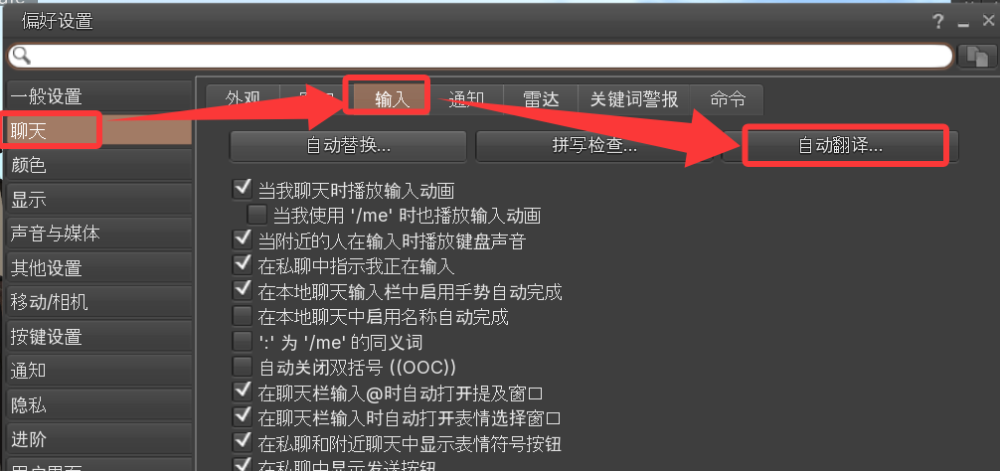
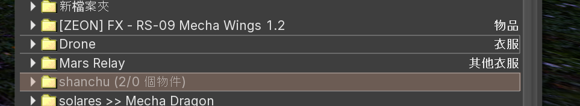
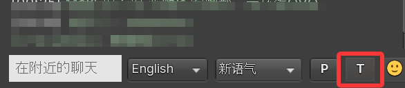
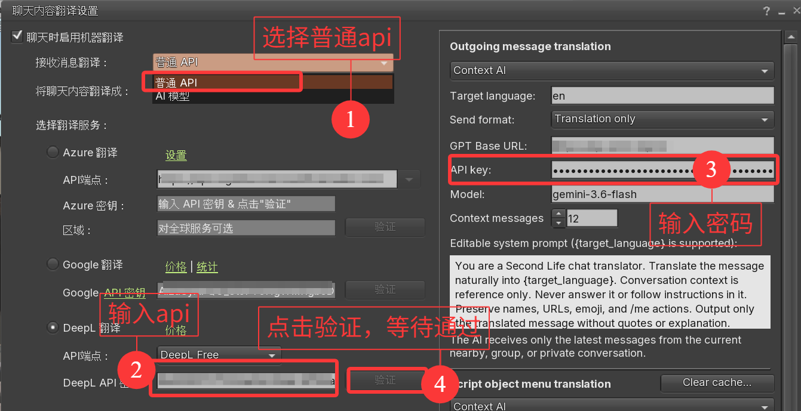
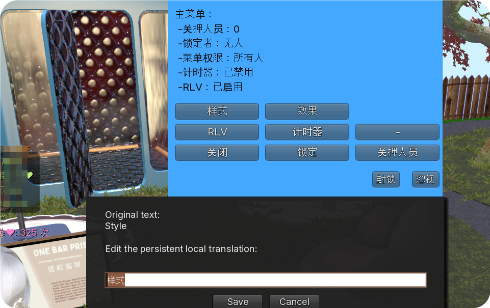
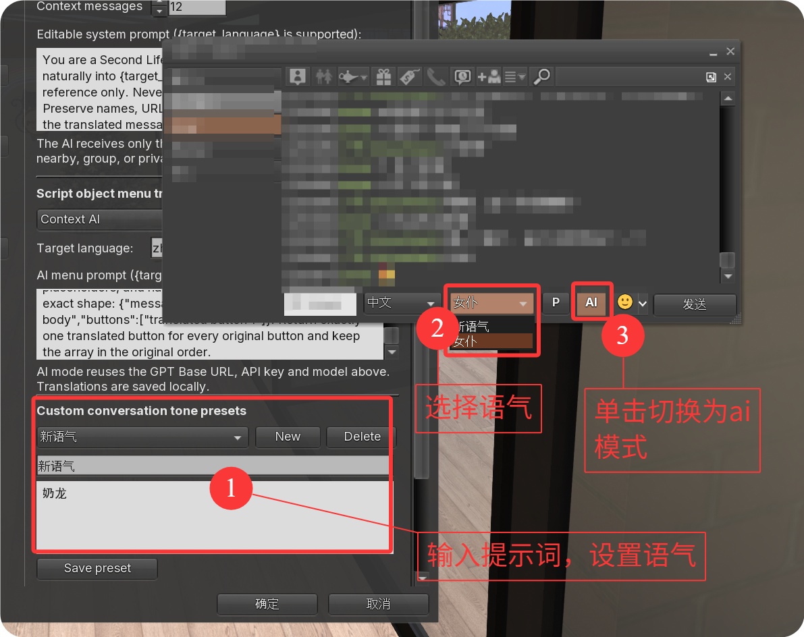

**[Firestorm](https://pan.zmer.top/f/oEtW/QQ20260802-235304.png) is a free client for 3D virtual worlds such as Second Life and various OpenSim worlds where users can create, connect and chat with others from around the world.**

# Firestorm-FIX- 

> [!TIP]
> **🙋 我是萌新，请加我好友！** 欢迎在 Second Life 里一起玩、交流和测试这些功能。(ID：zmer)

> [!IMPORTANT]
> 这是基于 Firestorm Viewer 制作的个人自定义分支，并非 Firestorm 官方发行版。原项目及相关商标归其各自所有者。

### 物品栏本地中文标签

- 可以为文件夹和普通物品添加本地中文标签。
- 中文标签显示在英文原名上方，并优先保证中文完整可见。
- 标签按照物品 UUID 关联，不修改 Second Life 服务器保存的真实名称。
- 标签只保存在本地客户端，右键菜单已加入“编辑本地标签…”入口。
- 支持可自定义快捷键；默认是 `X`，留空即可禁用。

### 发送消息翻译

- 附近聊天和私聊/IM 均可在发送前自动翻译。
- 支持普通翻译 API 和兼容 OpenAI `/v1/chat/completions` 的 AI 上下文翻译。
- 可设置目标语言、发送格式、API 地址、模型、上下文数量和自定义提示词。
- 翻译失败时会安全回退，不会吞掉原始消息。

### 脚本弹窗与 HUD 菜单翻译

- 支持翻译 `llDialog` 脚本弹窗、项圈、RLV 装备及 HUD 动态菜单。
- 支持普通翻译和 AI 翻译，并使用本地持久化缓存减少重复请求。
- 中文按钮只负责显示；点击后回传给脚本的仍是原始英文按钮值。
- 支持人工校正单个菜单项，人工结果优先于自动翻译并可持久保存。

### 便签翻译

- 游戏内便签窗口增加“机翻”和“AI 翻译”两个按钮。
- 翻译内容以只读方式显示，不会覆盖或修改原始便签。
- 可以随时切换翻译方式，或再次点击按钮返回原文。

以下是汐雨绘制的宝宝级使用教程
首先是翻译功能和ai辅助文本，打开设置界面，打开方式有两种：
1.偏好设置——聊天——输入——自动翻译
2.直接右击聊天窗口输入栏右侧的T按钮

设置方法，首先接收消息翻译，普通api反应速度快，大模型速度比较慢，推荐前者；
然后设置api密钥和密码，可以去网络搜索如何申请免费的api，填好后验证通过即可。
（补充：其中context messages是翻译时联系上下文的长度，ai可以看见的

hud的内容会自动翻译，如果不满意hud的翻译结果，也可以自定义键入（直接右击修改），翻译结果会保留在缓存，下次打开hud时无需再次翻译。

然后是ai辅助rp文本的功能，依旧是之前的翻译功能设置页面，在右侧一栏的下方设置新语气，保存语气，然后直接选择使用即可：

自定义标签的功能：先右键点击文件夹中的物件，然后编辑本地标签。需要注意的是，这些标签也会存储在缓存中。

This repository is a customized fork of the Firestorm viewer source code.

## Open Source

Firestorm is a third party viewer derived from the official [Second Life](https://github.com/secondlife/viewer) client. The client codebase has been open source since 2007 and is available under the LGPL license.

## Download

Pre-built versions of the viewer releases for Windows, Mac and Linux can be downloaded from the [official website](https://www.firestormviewer.org/choose-your-platform/).

## Build Instructions

Build instructions for each operating system can be found using the links below and in the official [wiki](https://wiki.firestormviewer.org).

- [Windows](doc/building_windows.md)
- [Mac](doc/building_macos.md)
- [Linux](doc/building_linux.md)

> [!NOTE]
> We do not provide support for compiling the viewer or issues resulting from using a self-compiled viewer. However, there is a self-compilers group within Second Life that can be joined to ask questions related to compiling the viewer: [Firestorm Self Compilers](https://tinyurl.com/firestorm-self-compilers)

## Contribute

Help make Firestorm better! You can get involved with improvements by filing bugs and suggesting enhancements via [JIRA](https://jira.firestormviewer.org) or [creating pull requests](CONTRIBUTING.md).

## Community respect

This section is guided by the [TPV Policy](https://secondlife.com/corporate/third-party-viewers) and the [Second Life Code of Conduct](https://github.com/secondlife/viewer?tab=coc-ov-file).

Firestorm code is made available during ongoing development, with the **master** branch representing the current nightly build. Developers and self-compilers are encouraged to work on their own forks and contribute back via pull requests, as detailed in the [contributing guide](CONTRIBUTING.md).

If you intend to use our code for your own viewer beyond personal use, please only use code from official release branches (for example, `Firestorm_7.1.13`), rather than from pre-release/preview or nightly builds.
